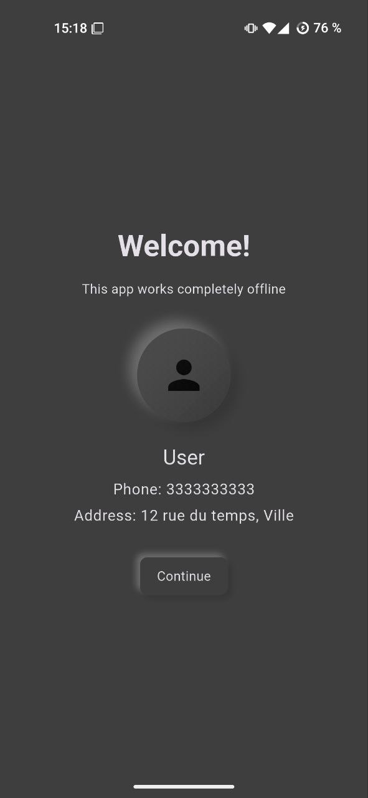
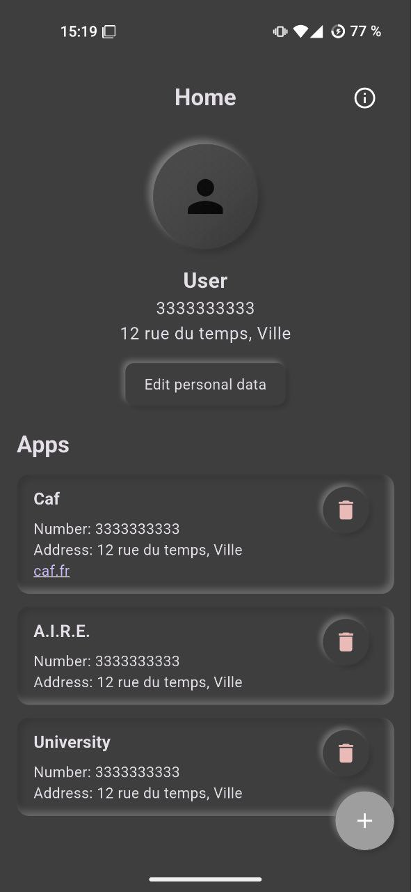
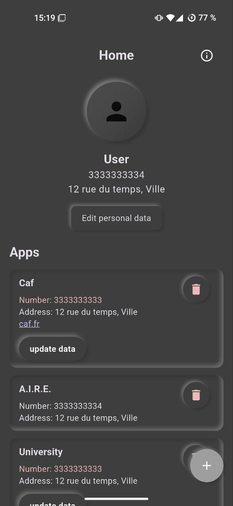

# 📱 AddressKeeper

Keep track of every website and app where you've submitted your personal contact details, so you never forget to update them again.

[Google PlatStore download](https://play.google.com/store/apps/details?id=com.ctrlvnt.addresskeeper)

---

## ✨ Features

- 🔍 Track where you've entered your **phone number** and **home address**
- 📝 Add websites or apps manually with optional URLs
- 📌 See which apps have your most recent contact info
- 🔔 Easily update and manage outdated entries
- 🧠 Never forget where your data lives

---

## 📸 Screenshots

  
  
  

---
## ☕ Support the Project
If you like this project and want to support me:

